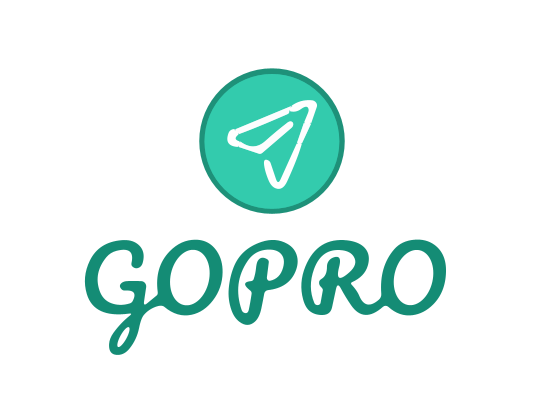

# GoPro - Project Management Platform

<div align="center">
  
  <h3>A comprehensive full-stack project management solution</h3>
</div>

## 🚀 Overview

GoPro is a modern, role-based project management platform built with React, Node.js, and MySQL. It provides a complete solution for managing projects, tasks, and team collaboration with different access levels for administrators, managers, and regular users.

## 📊 Project Presentation

For a detailed overview of the project, including architecture, features, and implementation details, check out our project presentation:

**[📋 View Project Presentation](https://docs.google.com/presentation/d/1RS1VDM9_LYE_W1LrW6nAHuH9c251GQBe/edit?usp=sharing&ouid=105537588207405972480&rtpof=true&sd=true)**

*The presentation covers:*
- Project architecture and design decisions
- Technology stack overview
- Feature demonstrations

## ✨ Features

### 🔐 Role-Based Access Control
- **Admin**: User management, system administration
- **Gestionnaire (Manager)**: Project and task management, team assignment
- **User**: View assigned projects and tasks, update task status

### 📊 Project Management
- Create, update, and delete projects
- Assign team members to projects
- Track project status and progress
- Search and filter projects
- Project statistics and analytics

### ✅ Task Management
- Create and assign tasks within projects
- Set task priorities and deadlines
- Update task status (pending, in progress, completed)
- Assign multiple users to tasks
- Task progress tracking

### 👥 User Management
- User registration and authentication
- Profile management
- Role-based permissions
- User search and filtering

### 🎨 Modern UI/UX
- Material-UI components for consistent design
- Responsive layout for all devices
- Intuitive navigation and user experience
- Real-time notifications with SweetAlert2

## 🏗️ Architecture

### Frontend (React)
```
client/
├── src/
│   ├── components/
│   │   ├── admin/          # Admin-specific components
│   │   ├── gestionnaire/   # Manager-specific components
│   │   ├── user/          # User-specific components
│   │   └── Profile.js     # Shared profile component
│   ├── guard/             # Route protection components
│   ├── views/             # Main page components
│   └── img/              # Static assets
```

### Backend (Node.js/Express)
```
server/
├── controller/           # Business logic
├── model/              # Database models
├── routes/             # API endpoints
├── middlewares/        # Authentication & authorization
└── db.js              # Database connection
```

## 🛠️ Technology Stack

### Frontend
- **React 18** - UI framework
- **Material-UI** - Component library
- **React Router** - Navigation
- **Axios** - HTTP client
- **JWT Decode** - Token handling
- **SweetAlert2** - Notifications

### Backend
- **Node.js** - Runtime environment
- **Express.js** - Web framework
- **MySQL** - Database
- **JWT** - Authentication
- **Bcrypt** - Password hashing
- **CORS** - Cross-origin resource sharing

## 📋 Prerequisites

Before running this application, make sure you have the following installed:

- **Node.js** (v14 or higher)
- **MySQL** (v8.0 or higher)
- **npm** or **yarn**

## 🚀 Installation & Setup

### 1. Clone the Repository
```bash
git clone <repository-url>
cd GoPro
```

### 2. Database Setup
1. Create a MySQL database
2. Import the database schema (contact for schema file)
3. Create a `.env` file in the `server/` directory:

```env
user=your_mysql_username
host=localhost
password=your_mysql_password
database=your_database_name
port=3001
JWT_SECRET=your_jwt_secret_key
```

### 3. Install Dependencies

#### Backend Setup
```bash
cd server
npm install
```

#### Frontend Setup
```bash
cd client
npm install
```

### 4. Start the Application

#### Start Backend Server
```bash
cd server
npm start
# or if nodemon is configured
nodemon index.js
```

#### Start Frontend Development Server
```bash
cd client
npm start
```

The application will be available at:
- **Frontend**: http://localhost:3000
- **Backend API**: http://localhost:3001

## �� API Documentation

### Authentication Endpoints

| Method | Endpoint | Description | Access |
|--------|----------|-------------|---------|
| POST | `/user/login` | User login | Public |
| POST | `/user/add` | Add new user | Admin |
| POST | `/user/update` | Update user | Admin |
| DELETE | `/user/delete` | Delete user | Admin |
| GET | `/user/list` | Get all users | Admin, Manager |
| GET | `/user/getUserById` | Get user by ID | All authenticated |

### Project Endpoints

| Method | Endpoint | Description | Access |
|--------|----------|-------------|---------|
| GET | `/projet/getList` | Get all projects | Manager |
| GET | `/projet/getProjectById` | Get project by ID | Manager, User |
| POST | `/projet/add` | Create new project | Manager |
| POST | `/projet/update` | Update project | Manager |
| DELETE | `/projet/delete` | Delete project | Manager |
| POST | `/projet/affectuser` | Assign user to project | Manager |
| GET | `/projet/statistics` | Get project statistics | All authenticated |
| GET | `/projet/myprojects` | Get user's projects | User |

### Task Endpoints

| Method | Endpoint | Description | Access |
|--------|----------|-------------|---------|
| GET | `/tache/tachesByProject/:id` | Get tasks by project | Manager |
| POST | `/tache/add` | Create new task | Manager |
| POST | `/tache/update` | Update task | Manager |
| DELETE | `/tache/delete` | Delete task | Manager |
| POST | `/tache/affectuser` | Assign user to task | Manager |
| POST | `/tache/updateStatus` | Update task status | Manager, User |
| GET | `/tache/myTaskInProject` | Get user's tasks in project | User |

## 🔐 Authentication & Authorization

The application uses JWT (JSON Web Tokens) for authentication. Each API request (except login) requires a valid JWT token in the Authorization header:

```
Authorization: Bearer <your-jwt-token>
```

### Role Permissions

- **Admin**: Full system access, user management
- **Gestionnaire**: Project and task management, team assignment
- **User**: View assigned projects/tasks, update task status

## 🎯 Usage Examples

### Creating a New Project (Manager)
```javascript
// API call to create a project
const response = await axios.post('/projet/add', {
  nom: 'New Project',
  description: 'Project description',
  date_debut: '2024-01-01',
  date_fin: '2024-12-31'
}, {
  headers: { Authorization: `Bearer ${token}` }
});
```

### Assigning Users to Tasks
```javascript
// API call to assign user to task
const response = await axios.post('/tache/affectuser', {
  id_tache: 1,
  id_user: 2
}, {
  headers: { Authorization: `Bearer ${token}` }
});
```

### Updating Task Status
```javascript
// API call to update task status
const response = await axios.post('/tache/updateStatus', {
  id_tache: 1,
  status: 'completed'
}, {
  headers: { Authorization: `Bearer ${token}` }
});
```

## 🎨 Screenshots

### Login Page


### Dashboard


### Project Management


## 🤝 Contributing

1. Fork the repository
2. Create a feature branch (`git checkout -b feature/amazing-feature`)
3. Commit your changes (`git commit -m 'Add some amazing feature'`)
4. Push to the branch (`git push origin feature/amazing-feature`)
5. Open a Pull Request

## 📝 License

This project is licensed under the ISC License.

## 👥 Support

For support and questions:
- Create an issue in the repository
- Contact the development team

## 🔄 Version History

- **v1.0.0** - Initial release with basic project management features
- **v1.1.0** - Added task management and user assignment
- **v1.2.0** - Enhanced UI with Material-UI components
- **v1.3.0** - Added statistics and reporting features

---

<div align="center">
  <p>Built with ❤️ using React, Node.js, and MySQL</p>
  <p>GoPro - Empowering Project Management</p>
</div>
